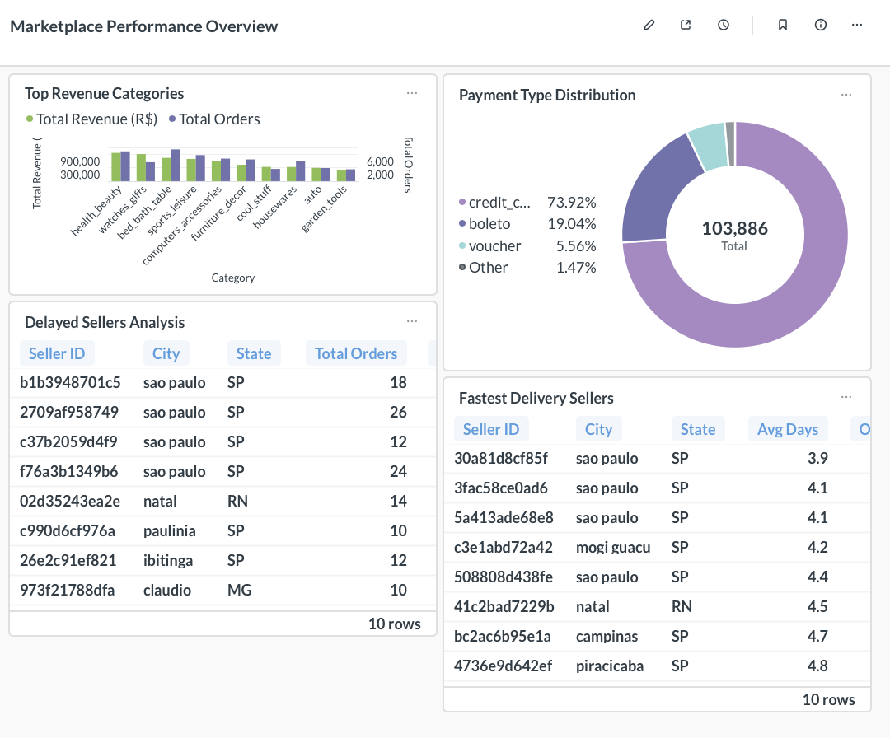

# E-Commerce Analytics Dashboard

Interactive business intelligence dashboard analyzing **99,441 orders** from a Brazilian e-commerce marketplace using **MySQL**, **Metabase**, and **Python**.

---

## Overview

This project transforms raw marketplace transaction data into actionable business insights through a relational database, advanced SQL analytics, and interactive dashboards.

The analysis covers customer behavior, seller performance, revenue generation, payment preferences, and delivery operations across nearly 100,000 marketplace orders.

---

## Key Insights

- **Revenue Analysis:** Identified top-performing product categories generating **R$13.5M** in total revenue.
- **Payment Trends:** **74%** of customers prefer credit card payments (**103,886 transactions**).
- **Operational Issues:** Detected sellers with **50–88% delay rates**, compared to the marketplace average of **8%**.
- **Performance Benchmarks:** Top-performing sellers deliver orders in **3.9–4.8 days**, significantly outperforming the marketplace average.

---

## Dashboard Preview



---

## Technology Stack

| Component | Technology |
|------------|------------|
| Database | MySQL |
| Visualization | Metabase (Docker) |
| Data Processing | Python (pandas) |
| Version Control | Git & GitHub |

---

## Database Schema

The database consists of **8 normalized tables (3NF)** with referential integrity enforced through primary and foreign key constraints.

| Table | Records | Description |
|---------|---------:|-------------|
| Customer | 99,441 | Buyer information and geographic location |
| Seller | 3,095 | Merchant profiles |
| Category | 73 | Product classifications |
| Product | 32,951 | Product catalog and physical attributes |
| CustomerOrder | 99,441 | Order lifecycle and fulfillment data |
| OrderItem | 112,650 | Individual order line items |
| Payment | 103,886 | Payment transactions |
| Review | 99,224 | Customer ratings and feedback |

For a complete schema and relationship diagram, see **[ER Diagram](er_diagram.pdf)**.

---

## Dashboard Visualizations

### 1. Top Revenue Categories

**Visualization:** Horizontal Bar Chart

**Key Finding:**  
Health & Beauty generated the highest revenue (**R$1.26M**), followed by Watches & Gifts (**R$1.21M**).

---

### 2. Payment Type Distribution

**Visualization:** Pie Chart

**Key Finding:**

| Payment Type | Share |
|-------------|--------:|
| Credit Card | 73.92% |
| Boleto | 19.04% |
| Voucher | 5.56% |
| Other | 1.48% |

---

### 3. Delayed Sellers Analysis

**Visualization:** Performance Table

**Key Finding:**  
Identifies sellers with **33–88% delayed delivery rates**, compared to the marketplace baseline of **7.9%**.

**Business Value:**  
Supports targeted seller performance interventions and operational improvement initiatives.

---

### 4. Fastest Delivery Sellers

**Visualization:** Ranked Performance Table

**Key Finding:**  
Top-performing sellers achieve average delivery times between **3.9 and 4.9 days**.

**Business Value:**  
Provides operational benchmarks for fulfillment excellence and SLA planning.

---

## Getting Started

### Prerequisites

Install Docker Desktop and MySQL.

```bash
brew install mysql
```

### Database Setup

Start MySQL:

```bash
mysql.server start
```

Create the database:

```sql
mysql -u root -p

CREATE DATABASE olist;

exit;
```

Load the schema and data:

```bash
mysql -u root -p olist < setup.sql

mysql --local-infile=1 -u root -p olist < load.sql
```

### Launch Metabase

Start the Metabase Docker container:

```bash
docker run -d \
  -p 3000:3000 \
  --name metabase \
  metabase/metabase
```

Open:

```text
http://localhost:3000
```

Connect using the following configuration:

| Setting | Value |
|----------|--------|
| Host | host.docker.internal |
| Port | 3306 |
| Database | olist |
| Username | root |

### Run Analytical Queries

```bash
mysql -u root -p olist < queries.sql
```

---

## Advanced SQL Features

This project demonstrates proficiency in:

- Multi-table joins
- Common Table Expressions (CTEs)
- Window functions
- Conditional aggregation
- Date arithmetic
- Correlated and nested subqueries
- Aggregate functions
- Post-aggregation filtering using `HAVING`

### SQL Concepts Demonstrated

| Feature | Application |
|----------|-------------|
| Multi-Table JOINs | Product, seller, order, review analysis |
| CTEs | Marketplace benchmarking and reusable query logic |
| Window Functions | Comparative performance analysis |
| CASE Statements | Delay-rate calculations |
| DATEDIFF() | Delivery time measurement |
| Subqueries | Advanced filtering and ranking |
| Aggregation | Revenue, order, and customer metrics |
| HAVING Clauses | Threshold-based filtering |

---

## Example Query: Delayed Sellers vs Marketplace Average

```sql
WITH marketplace_avg AS (
    SELECT
        COUNT(
            CASE
                WHEN order_delivered_customer_date >
                     order_estimated_delivery_date
                THEN 1
            END
        ) * 100.0 / COUNT(*) AS avg_delay_rate
    FROM CustomerOrder
    WHERE order_delivered_customer_date IS NOT NULL
),

seller_delays AS (
    SELECT
        s.seller_id,
        COUNT(DISTINCT co.order_id) AS total_orders,
        COUNT(
            CASE
                WHEN co.order_delivered_customer_date >
                     co.order_estimated_delivery_date
                THEN 1
            END
        ) * 100.0 / COUNT(*) AS delay_rate
    FROM Seller s
    JOIN OrderItem oi
        ON s.seller_id = oi.seller_id
    JOIN CustomerOrder co
        ON oi.order_id = co.order_id
    WHERE co.order_delivered_customer_date IS NOT NULL
    GROUP BY s.seller_id
    HAVING COUNT(DISTINCT co.order_id) >= 10
)

SELECT
    seller_id,
    total_orders,
    delay_rate,
    (
        SELECT avg_delay_rate
        FROM marketplace_avg
    ) AS market_avg
FROM seller_delays
WHERE delay_rate >
    (
        SELECT avg_delay_rate
        FROM marketplace_avg
    )
ORDER BY delay_rate DESC;
```

---

## Data Source

### Brazilian E-Commerce Public Dataset by Olist

Dataset characteristics:

- Approximately **100,000 orders**
- Transactions from **2016–2018**
- Real-world marketplace data
- Eight interconnected datasets
- Preprocessed using Python and pandas for data quality and consistency

---

## Sample Business Metrics

| Metric | Value | Context |
|----------|---------:|---------|
| Total Revenue | R$13.5M | Across 73 product categories |
| Average Order Value | R$136 | Per transaction |
| Largest Category Share | 9.3% | Health & Beauty |
| Credit Card Usage | 73.9% | Customer payment preference |
| Highest Seller Delay Rate | 88.5% | Compared to 7.9% market average |
| Fastest Average Delivery | 3.9 Days | Top-performing seller |

---

## Project Structure

```text
ecommerce-analytics-dashboard/
├── setup.sql
├── load.sql
├── cleanup.sql
├── queries.sql
├── preprocess_data.py
├── er_diagram.pdf
├── dashboard_screenshot.png
├── index.html
├── search.php
├── *_clean.csv
└── README.md
```

### File Descriptions

| File | Purpose |
|--------|---------|
| setup.sql | Creates database schema and constraints |
| load.sql | Imports cleaned datasets |
| cleanup.sql | Removes all tables |
| queries.sql | Analytical SQL queries |
| preprocess_data.py | Data cleaning and ETL pipeline |
| er_diagram.pdf | Entity-relationship diagram |
| dashboard_screenshot.png | Dashboard preview |
| index.html | Optional web interface |
| search.php | Optional backend implementation |
| README.md | Project documentation |

---

## Business Applications

This analytics framework supports several operational and strategic use cases:

### Category Management
Identify high-revenue categories for inventory planning and marketing investment.

### Seller Performance Monitoring
Detect underperforming sellers and support performance improvement initiatives.

### Payment Optimization
Improve checkout experiences based on customer payment preferences.

### Logistics Planning
Establish delivery benchmarks and service-level agreements (SLAs).

### Customer Analytics
Analyze purchasing behavior and geographic spending patterns to support growth strategies.